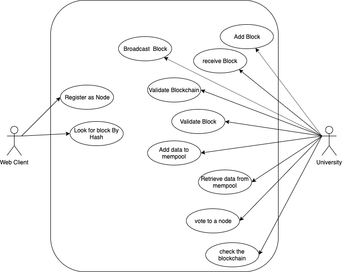

## Graduates BlockChain

a blockchain built to store the names of the gradutes that year from each university in the network with their certificate's hash.

### Motivation :

Our eduaction is one of the most important things that we have, we must store safely, usually in a safe vault, why not store it everywhere ? 

 ### why blockchain ?
 
 blockchain is immutable, no one can manipulate the data after it's submitted, not even the university it self. We plan to use it's features. 

### Use Case Diagram
 

 
